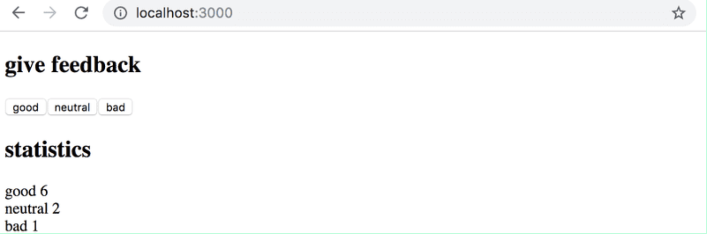
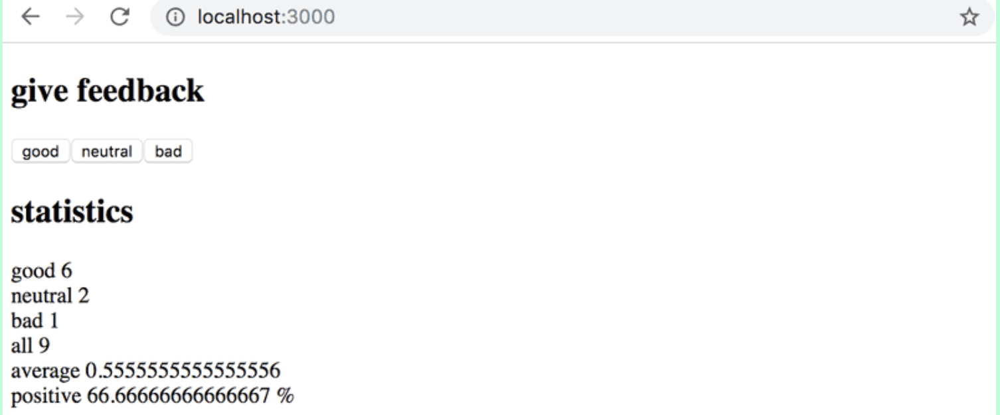
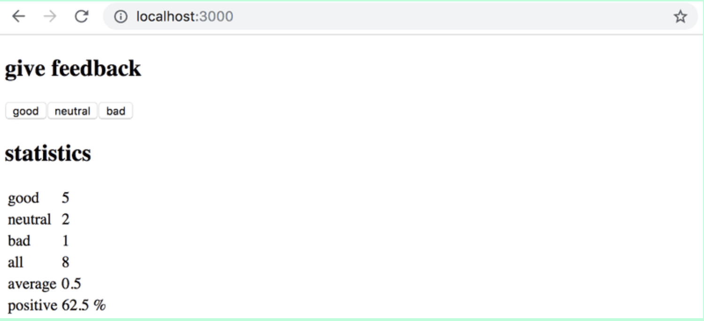

Exercise 1:

Like most companies, the student restaurant Unicafe collects feedback from its customers. Your task is to implement a web application for collecting customer feedback. There are only three options for feedback: good, neutral, and bad.

The application must display the total number of collected feedback for each category. Your final application could look like this:



Note that your application needs to work only during a single browser session. Once you refresh the page, the collected feedback is allowed to disappear.

Exercise 2:

Expand your application so that it shows more statistics about the gathered feedback: the total number of collected feedback, the average score (the feedback values are: good 1, neutral 0, bad -1) and the percentage of positive feedback.



Exercise 3:

Refactor your application so that displaying the statistics is extracted into its own Statistics component. The state of the application should remain in the App root component.

Remember that components should not be defined inside other components:

```js
// a proper place to define a component
const Statistics = (props) => {
  // ...
}

const App = () => {
  const [good, setGood] = useState(0)
  const [neutral, setNeutral] = useState(0)
  const [bad, setBad] = useState(0)

  // do not define a component within another component
  const Statistics = (props) => {
    // ...
  }

  return (
    // ...
  )
}
```

Exercise 4:

Display the statistics in an HTML table, so that your application looks roughly like this:

