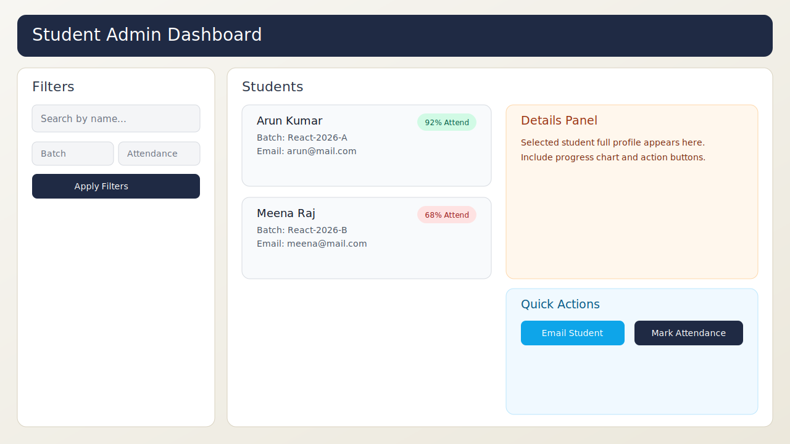
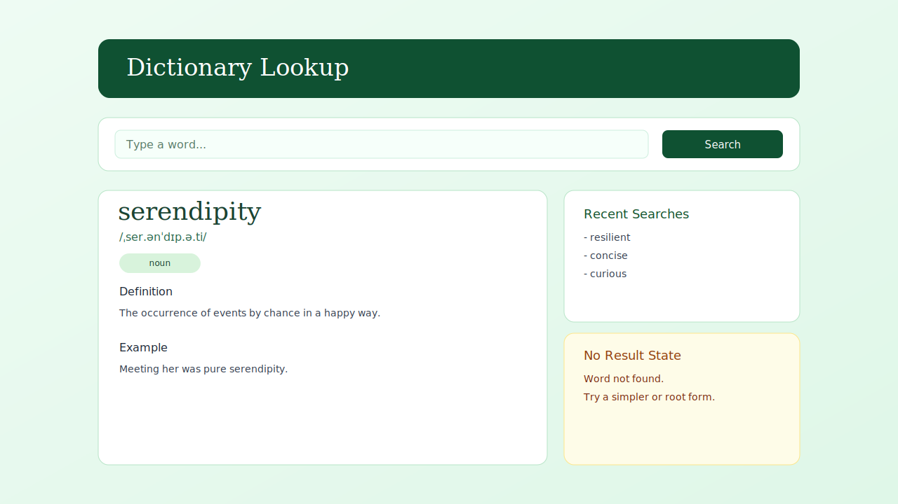
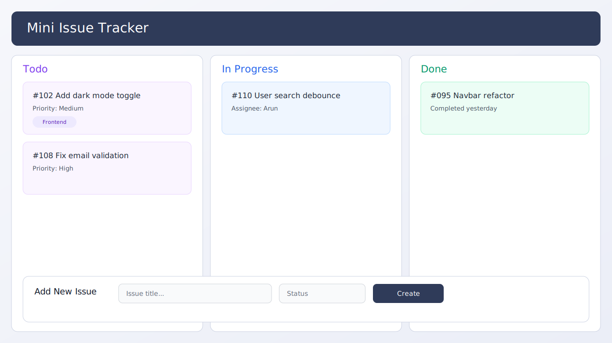
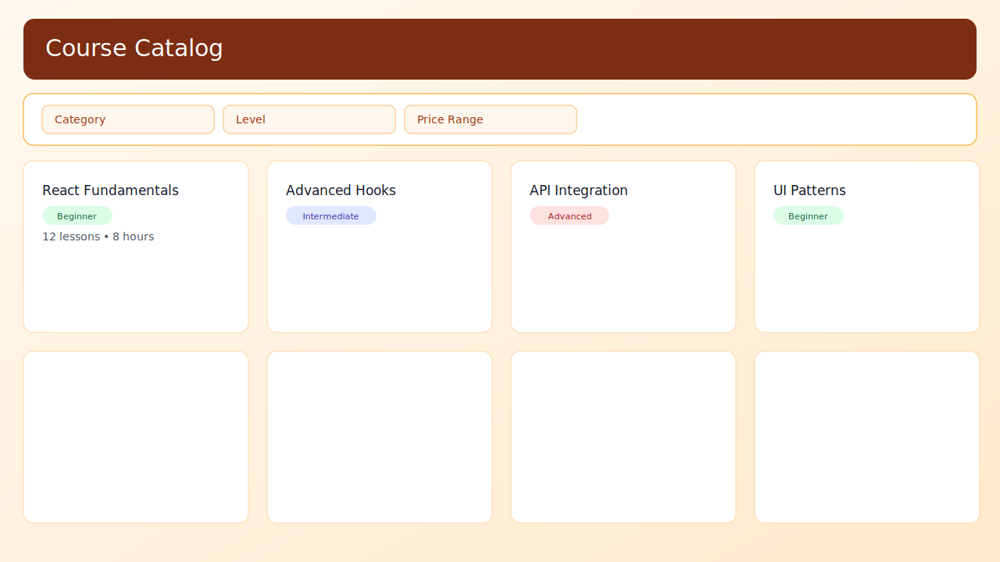

## React Exercises

These exercises are designed from the topics you already covered in class, but with more real-world use cases and clearer acceptance criteria.

## Design Mockups

Use these reference mockups while implementing:

## APIs You Can Use

- Users: `https://jsonplaceholder.typicode.com/users`
- Posts: `https://jsonplaceholder.typicode.com/posts`
- Products: `https://fakestoreapi.com/products`
- Dictionary: `https://api.dictionaryapi.dev/api/v2/entries/en/<word>`

## Module 1: Components and File Structure

### 1. Team Intro Page

Scenario:
You are building the home page of a startup website.

Build:
- `Header`, `Hero`, `TeamSection`, `Footer` components.
- Each component in its own file.
- Render all from `App`.

Data:
- Team list with 3 members (name, role, city).

Acceptance Checklist:
- No component file is longer than 60 lines.
- All components are imported correctly.
- Page has clear visual section separation.

### 2. Reusable Info Card

Scenario:
Your company wants a reusable card pattern for any small content block.

Build:
- Create `InfoCard` component with props: `title`, `subtitle`, `tag`.
- Reuse it at least 4 times with different data.

Acceptance Checklist:
- No hardcoded text inside `InfoCard` except fallback labels.
- Card style is shared; only data changes via props.

## Module 2: Props and Data Flow

### 3. Student Profile Panel (Parent to Child)

Scenario:
Admin should quickly view one student profile.

Build:
- Parent stores selected student object.
- Child `StudentCard` shows: name, batch, email, city, attendance.
- Add "Next Student" button in parent to switch record.

Acceptance Checklist:
- Child receives all data through props.
- UI updates immediately when parent changes data.

### 4. Feedback Widget (Child to Parent)

Scenario:
You need a small feedback widget under lesson videos.

Build:
- Child component shows: `Too Fast`, `Good Pace`, `Too Slow` buttons.
- Child sends selected feedback back to parent.
- Parent displays latest feedback and total click count.

Acceptance Checklist:
- Parent state is the single source of truth.
- Child does not store final result state.

### 5. Multi-level User Context (Props Drilling)

Scenario:
You have deeply nested layout components.

Build:
- `App -> Layout -> Sidebar -> UserBadge`.
- Pass `userName` and `plan` from `App` to `UserBadge` only via props.

Acceptance Checklist:
- No global state libraries.
- Intermediate components forward props explicitly.

## Module 3: useState in Real Components

### 6. Reaction Counter

Scenario:
Create a reaction bar for blog posts.

Build:
- State: `likes`, `claps`, `bookmarks`.
- Buttons to increment each.
- Show derived value: `totalReactions`.

Acceptance Checklist:
- Separate handlers are used.
- Derived total is calculated, not separately stored.

### 7. Profile Editor (Object State)

Scenario:
A user edits profile details in one panel.

Build:
- State object: `name`, `email`, `phone`, `city`.
- 4 controlled inputs.
- `Save` button prints final object in UI.

Acceptance Checklist:
- Updating one field does not erase other fields.
- Use functional state updates for safety.

### 8. Quantity Manager with Constraints

Scenario:
Cart item quantity manager for an ecommerce app.

Build:
- Buttons: `-`, `+`, `Reset`.
- Quantity cannot go below 1 or above 10.
- Show warning text when user hits limits.

Acceptance Checklist:
- Proper boundary checks exist.
- Warning text is conditionally rendered.

## Module 4: List Rendering and Keys

### 9. Course Catalog Grid

Scenario:
Display available courses in a training portal.

Build:
- Render array of objects with fields: `id`, `title`, `level`, `duration`.
- Show as grid cards.
- Add level badge color mapping (Beginner/Intermediate/Advanced).

Acceptance Checklist:
- Stable `key` uses `id`.
- List is generated only with `map()`.

### 10. Dynamic Skills List

Scenario:
User manages personal skills list.

Build:
- Input + `Add Skill` button.
- Render skills list.
- Remove individual skill.

Acceptance Checklist:
- No duplicate skill entries allowed.
- Empty input should not be added.

## Module 5: Conditional Rendering Patterns

### 11. Auth Status Banner (if...else)

Build:
- State `isLoggedIn`.
- Render full welcome panel when true.
- Render login prompt panel when false.
- Use explicit `if...else` block.

### 12. Pass/Fail Evaluator (Ternary)

Build:
- Input score (0 to 100).
- Show `Pass` if score >= 40, otherwise `Fail`.
- Use ternary operator in JSX.

### 13. Product Tag Display (Logical AND)

Build:
- Product card has `isNew` boolean.
- Render `NEW` badge only when true with `&&`.

## Module 6: Forms (Controlled vs Uncontrolled)

### 14. Uncontrolled Quick Search

Build:
- Search input using `useRef`.
- On submit, show keyword below.
- Clear input after submit.

Acceptance Checklist:
- No `useState` for input value.

### 15. Controlled Registration Form

Build:
- Fields: name, email, password.
- Inline validation:
  - name min 3 chars
  - email contains `@`
  - password min 6 chars
- Disable submit until all fields valid.

Acceptance Checklist:
- Entire form is controlled with `useState`.
- Error messages update in real time.

## Module 7: Lifecycle and useEffect

### 16. Lifecycle Logger (Class)

Build:
- Create class component with a counter.
- Log mount and update lifecycle methods.
- Add button to trigger updates.

Acceptance Checklist:
- Console clearly shows method call order.

### 17. useEffect Frequency Lab

Build 3 mini components:
- Effect without dependency array.
- Effect with empty dependency array.
- Effect with `[count]` dependency.

Acceptance Checklist:
- Each component displays when effect runs.
- Add short note explaining observed behavior.

## Module 8: API Calls and Rendering

### 18. User Directory (Fetch)

Build:
- Fetch users from JSONPlaceholder.
- Display cards: name, email, city.
- Search users by name (client-side filter).

Acceptance Checklist:
- Loading and error states are visible.
- Search is case-insensitive.

### 19. Posts Feed (Axios)

Build:
- Fetch posts using axios.
- Show first 15 posts.
- Add retry button on failure.

Acceptance Checklist:
- `axios` is installed and used.
- Retry triggers a fresh request.

### 20. Legacy XHR Adapter

Build:
- Fetch same users endpoint using `XMLHttpRequest`.
- Convert response and render in list.

Acceptance Checklist:
- Handles status-code errors.
- Handles network errors separately.

### 21. Dictionary Lookup

Build:
- Input word and submit.
- Fetch dictionary API.
- Show word, phonetic, part of speech, first definition.

Acceptance Checklist:
- Graceful message for invalid word/no result.
- Prevent empty submit.

## Module 9: useRef Practical

### 22. Autofocus + Manual Focus

Build:
- On first load, focus search input.
- Add `Focus Search` button to focus again.

Acceptance Checklist:
- Works on mount and on button click.

### 23. Previous Value Tracker

Build:
- Counter with increment button.
- Show current value and previous value.
- Store previous value in `useRef`.

Acceptance Checklist:
- Previous value updates only after render cycle.

## Integrated Real-World Challenges

### 24. Student Admin Dashboard

Use mockup: `./designs/student-admin-dashboard.svg`

Build:
- Left panel: filter inputs (name and batch).
- Right panel: student list cards.
- Clicking card opens detailed panel.

Must Include:
- Parent-child props.
- Controlled filters.
- Conditional rendering for empty state.

### 25. Mini Issue Tracker Board

Use mockup: `./designs/issue-tracker-board.svg`

Build:
- Columns: Todo, In Progress, Done.
- Render issues by status.
- Add issue form.
- Allow status change with dropdown.

Must Include:
- List rendering with stable keys.
- Complex state updates.
- At least one reusable card component.

### 26. Course Catalog + API Merge

Use mockup: `./designs/course-catalog-grid.svg`

Build:
- Local category filter state.
- API product data rendering.
- Display cards in responsive grid.

Must Include:
- `useEffect` data fetch.
- Loading/success/error states.
- Conditional badge rendering.

